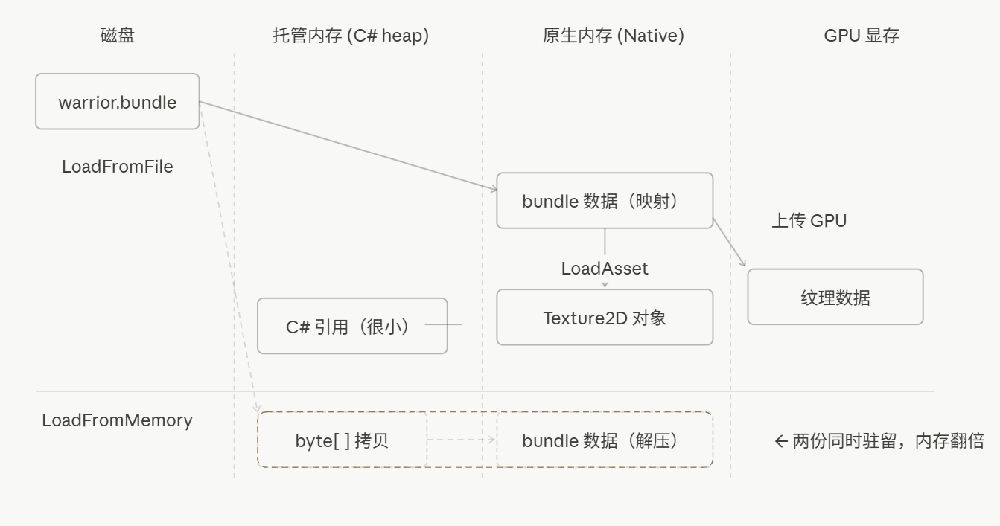
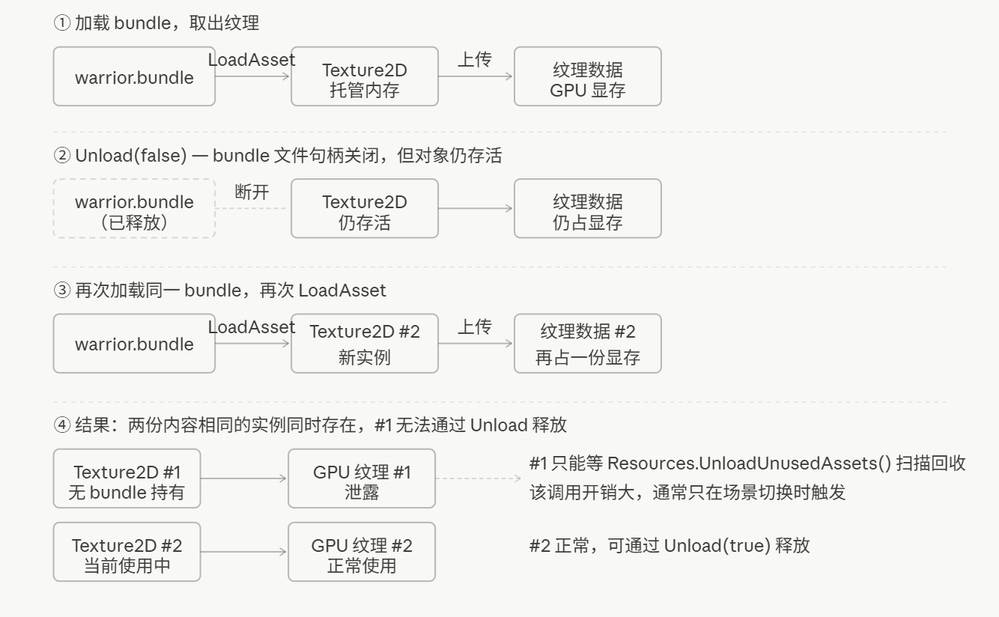
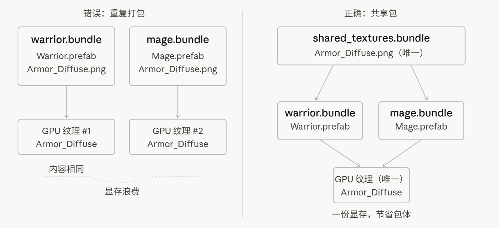
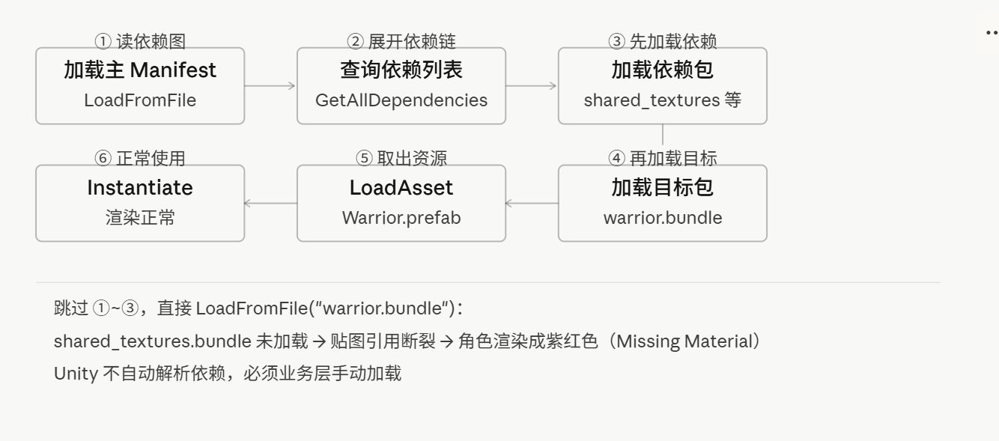

# Unity 资源管理(一)：AssetBundle深入解析

当我们需要动态加载资源的时候，最简单的方式是使用`Resources`，但所有放进 `Resources` 文件夹的资源都会打入包体，不管能不能用到，这容易导致初始包体很大，并且它也不支持热更新。

一个比较常见的资源管理结构是：

```
Resources
    少量固定资源（配置、基础 UI、小图标）

Addressables / AssetBundle
    游戏主要资源（角色、场景、音频、特效等）

StreamingAssets
    原始文件、配置、初始热更新资源
```

既然主要资源都使用AssetBundle，它到底是什么呢？

---

## AssetBundle 是什么

AssetBundle（以下简称 AB）是 Unity 提供的资源打包格式，**本质上是一个压缩文件**，可以包含模型、贴图、预制体、场景、音频等几乎所有类型的 Unity 资源。AB 文件可以存放在本地，也可以部署到服务器上，运行时通过代码按需加载，与安装包完全解耦。

AB 的工作流分三步：**打包 → 加载 → 卸载**。

### 打包

通过 `Editor` 脚本调用 `BuildPipeline.BuildAssetBundles` 完成，一个最简单的打包案例：

```csharp
[MenuItem("Build/Build AssetBundles")]
static void Build()
{
    BuildPipeline.BuildAssetBundles(
        "Assets/StreamingAssets",		//存放的文件夹
        BuildAssetBundleOptions.None,	//压缩方式
        BuildTarget.StandaloneWindows	//目标平台
    );
}
```

打包时需要选择压缩格式，`BuildAssetBundleOptions` 提供三种压缩选项：

| 格式 | 选项 | 包体大小 | 解压速度 | 适用场景 |
|---|---|---|---|---|
| 不压缩 | `UncompressedAssetBundle` | 最大 | 最快 | 开发调试 |
| LZMA(高度压缩) | `None`（默认） | 最小 | 慢，需整包解压 | 网络下载 |
| LZ4(中等压缩) | `ChunkBasedCompression` | 中等 | 快，按块解压 | 运行时本地加载 |

LZMA 体积最小，适合网络传输节省流量，但运行时必须把整个包解压后才能读取，内存开销大。LZ4 按块解压，随机访问快，是本地运行的推荐格式。实际项目里常见的做法是：下载时用 LZMA，落盘后通过**`AssetBundle.RecompressAssetBundleAsync`** 转换为 LZ4 再使用。

### 加载

加载分两步：先把 bundle 文件加载进来，再从中取出具体资源。

Unity 提供了四种加载 bundle 的方式：

| 方法 | 数据来源 | 内存特点 | 适用场景 |
|---|---|---|---|
| `LoadFromFile` | 本地文件 | 内存映射，直接从磁盘读取（磁盘文件 → (映射) → 引擎本地内存） | 本地缓存的 bundle |
| `LoadFromMemory` | byte\[\] | 数据需事先完整读入内存byte\[\]（磁盘文件 → **读取到托管 `byte[]`** → **拷贝/解压到引擎本地内存**） | 加密/定制数据 |
| `LoadFromStream` | Stream | 流式读取，内存可控 | 特殊IO层 |
| `UnityWebRequestAssetBundle` | 网络 / 本地 URI | 首次下载会存入磁盘缓存，下次请求直接读缓存 | 远程资源热更 |

大多数情况下优先选 `LoadFromFile`，内存占用最低；需要加密时用 `LoadFromStream` 在流中解密，避免 `LoadFromMemory` 带来的双份内存峰值(所有加载方式均有异步版本，**均推荐使用异步加载方式**)。

```csharp
AssetBundle bundle = AssetBundle.LoadFromFile(
    Path.Combine(Application.streamingAssetsPath, "warrior.bundle"));
GameObject prefab = bundle.LoadAsset<GameObject>("Warrior");
Instantiate(prefab);
```

#### 加载过程中的内存结构

补充一点相关的unity内存相关知识（有需要的话可以留言，单独写一篇）

**Disk File（磁盘文件）**：存储在硬盘（HDD/SSD）上的持久化文件，比如你的 `.bundle` 文件、StreamingAssets 下的资源。

**Native Memory（原生内存）**：由 Unity 引擎底层管理，C# GC 不可见。`LoadFromFile` 调用后，bundle 的原始数据通过内存映射驻留在这里，引擎按需读取。

**Managed Memory（托管内存）**：C# 的 GC 堆。`AssetBundle`、`Texture2D`、`AudioClip` 等 C# 对象存在这里，它们本质上只是对 Native 资源的引用包装，自身体积很小。

**GPU Memory（显存）**：`LoadAsset<Texture2D>` 完成时，Unity 会把纹理数据从 `Native Memory` 上传到 GPU，对于不可读纹理（`Read/Write Disabled`），Unity 通常会在上传 GPU 后释放 CPU 侧副本。网格数据在 `Mesh.UploadMeshData` 后同理。



`LoadFromFile` 通常会利用操作系统的文件映射/顺序读取机制，避免像 `LoadFromMemory` 那样先经过托管 `byte[]`，因此内存占用明显更低。

### 卸载

```csharp
bundle.Unload(bool unloadAllLoadedObjects); 
```

| 参数            | 释放 Bundle 文件 | 释放已加载的资源对象 | 适用场景                       |
| --------------- | ---------------- | -------------------- | ------------------------------ |
| `Unload(false)` | ✅                | ❌                    | 资源仍在使用中，只关闭文件句柄 |
| `Unload(true)`  | ✅                | ✅                    | 确认无引用残留，彻底释放内存   |

`Unload(true)` 时，如果场景中还有对象引用这些资源，立刻销毁会让贴图和网格丢失，渲染出错。

`Unload(false)` 也有隐患，容易导致内存泄露，比如：

1. 加载 `warrior.bundle`，调用 `LoadAsset<Texture2D>` →`Texture2D` 的 C# 对象进入 Managed Memory，而真正的纹理像素数据位于 Native Memory，并最终上传到 GPU。
2. 调用 `Unload(false)` → Native Memory 的 bundle 映射释放，但 `Texture2D` 对象和 GPU 数据仍然存活
3. 某处代码再次加载 `warrior.bundle`，再次 `LoadAsset<Texture2D>`
4. Unity 不知道第一份 Texture2D 还活着，创建出第二个独立的 Texture2D 实例，再次上传 GPU

结果是内存里存在两份独立的 `Texture2D` 实例，第一份已经没有任何 bundle 持有它，无法通过正常的 `Unload` 路径释放，只能等 `Resources.UnloadUnusedAssets()` 扫描回收——而这个调用本身开销很大，通常只在场景切换时才触发。



**正确做法**：`Unload(false)` 适合"资源仍在使用、只想关闭文件句柄"的场景，但必须配合引用计数，确保每份资源只加载一次，不重复 Load。确认所有引用都已释放后，调用 `Unload(true)` 彻底清理 Managed 和 GPU 两层内存。

---

## 重复打包

除了卸载可能导致资源丢失/内存泄露等问题，打包的时候也有一些注意事项：

假设 `Warrior.prefab` 和 `Mage.prefab` 都用了同一张贴图 `Armor_Diffuse.png`，如果把两个 prefab 直接各自打包，这张贴图会被打进两个 bundle 各一份。

理解这个问题需要知道 Unity 打包时的内部行为：Unity 用 GUID 追踪每一个资源，打包时会检查每个 bundle 里的资源引用了哪些依赖。**如果某个依赖资源没有被分配到任何 bundle**，Unity 不会报错，而是直接把它序列化进所有引用它的 bundle 里——这是一个"静默填充"的行为，目的是保证每个 bundle 自身完整可用。

在运行的时候，每个 AssetBundle 是独立的加载单元，Unity 不会跨 bundle 做资源去重。当 `warrior.bundle` 和 `mage.bundle` 同时被加载，各自的 `LoadAsset<Texture2D>` 调用会创建出两个独立的 `Texture2D` 实例，分别占用 CPU 内存，并各自向 GPU 上传一份纹理数据。两张内容完全相同的贴图同时存在于显存里，而整个过程没有任何警告。



这类共用资源一多，包体和内存都会悄悄膨胀，且很难从表面察觉。

从内存层次来看，每次 `LoadAsset<Texture2D>` 都会触发一次 GPU 上传，两份相同的贴图意味着显存里存了两份完全一样的纹理数据，显存的资源比内存贵多了。

**正确做法是**：将共用资源打入独立的 `shared_textures.bundle`，角色包只记录对它的依赖，不实际包含该纹理。加载时先加载依赖包，再加载目标包：

```csharp
AssetBundle sharedBundle  = AssetBundle.LoadFromFile("shared_textures.bundle");
AssetBundle warriorBundle = AssetBundle.LoadFromFile("warrior.bundle");
```

---

## 依赖加载顺序

做好了依赖分离，随之而来的是另一个问题：加载顺序。

### Manifest 文件

打包完成后，Unity 会在输出目录生成一个与目录同名的主 bundle（不带扩展名），以及每个 bundle 各自对应的 `.manifest` 文本文件。`.manifest` 是人类可读的 YAML 格式，记录了这个 bundle 包含哪些资源、依赖哪些其他 bundle、以及用于校验的 Hash 值。

以 `warrior.bundle.manifest` 为例，内容大致如下：

```yaml
ManifestFileVersion: 0
CRC: 2548370231
Hashes:
  AssetFileHash:
    serializedVersion: 2
    Hash: 9b2e4c1a8f3d7e6b0a5c2d4f1e8b3a7c
  TypeTreeHash:
    serializedVersion: 2
    Hash: 1c4a7f2e9b6d3a8c5e0f2b4d7a1c9e3f
Assets:
- Assets/GameRes/Characters/Warrior.prefab
Dependencies:
- shared_textures.bundle
```

关键字段说明：
- `Assets`：这个 bundle 直接包含的资源路径列表
- `Dependencies`：这个 bundle 依赖的其他 bundle 名称，加载时必须提前加载这些包
- `Hash`：bundle 内容的哈希值，热更新时用于判断文件是否有变动

主 bundle 的 `.manifest` 则汇总了所有 bundle 的依赖关系图，是运行时查询依赖的唯一数据源。

### 依赖加载

Unity 运行时并不会自动解析 bundle 依赖——引擎本身不知道 A 依赖 B，这个信息只存在于打包阶段生成的 `AssetBundleManifest` 中，不主动查询就等于这份依赖关系不存在。

如果直接加载 `warrior.bundle` 而没有提前加载 `shared_textures.bundle`，bundle 内部指向贴图的引用就是断的，实例化出来的角色会缺少贴图，渲染成紫红色。



**正确做法**：从主 bundle 中读取 `AssetBundleManifest` 对象，调用 `GetAllDependencies` 拿到完整依赖列表（递归，包含间接依赖），全部加载完毕后再加载目标包：

```csharp
AssetBundle manifestBundle = AssetBundle.LoadFromFile("AssetBundles");
AssetBundleManifest manifest = manifestBundle.LoadAsset<AssetBundleManifest>("AssetBundleManifest");

string[] deps = manifest.GetAllDependencies("warrior.bundle");
foreach (string dep in deps)
    AssetBundle.LoadFromFile(dep);

AssetBundle warriorBundle = AssetBundle.LoadFromFile("warrior.bundle");
```

复杂项目的依赖树可能很深，A 依赖 B，B 依赖 C 和 D。`GetAllDependencies` 会递归展开完整的依赖链，多次调用 `LoadFromFile` 加载同一路径的`bundel`项目会提示`AssetBundle with the same files is already loaded.`（内部引用计数），因此业务层建议自己维护已加载 bundle 的缓存，以便集中管理引用计数和卸载时机，Unity 不会自动递归卸载依赖。

---

## 版本管理混乱

版本管理的核心依赖 Manifest 文件。每次打包，Unity 为每个 bundle 生成哈希值，客户端通过对比本地和服务端的 manifest 来判断哪些 bundle 需要重新下载：

1. 客户端启动 → 从服务器下载最新 manifest
2. 对比每个 bundle 的 Hash128，Hash 不同说明内容有变化
3. 下载所有 Hash 不一致的 bundle，完成增量更新

| 字段 | 说明 | 用途 |
|---|---|---|
| Hash128 | 基于 bundle 内容生成，内容不变则 Hash 不变 | 增量更新判断 |
| CRC | 数据完整性校验 | 防止下载损坏或篡改 |
| 依赖关系 | 记录 bundle 间的依赖图 | 加载顺序控制 |

机制本身不复杂，但实际操作中有几个高频踩坑的地方：

**Manifest 和 Bundle 没有同步上传**

Manifest 是客户端判断"哪些 bundle 需要更新"的唯一依据，bundle 文件是实际下载的内容，两者必须作为原子操作一起上传。

常见的错误有两个方向：

- **只上传了 bundle，没有更新 manifest**：客户端拉到的仍是旧 manifest，Hash 比对没有差异，跳过下载。新 bundle 已经在 CDN 上了，但客户端完全不知道，玩家看不到任何更新，同时 CDN 上存在两个版本的 bundle，引发状态不一致。
- **只更新了 manifest，bundle 没有同步上传**：客户端发现 Hash 不一致，开始下载"新 bundle"，拿到的却是 CDN 上还没替换的旧文件，Hash 校验失败，更新流程报错或静默使用损坏数据。

正确做法是**先上传所有变更的 bundle，CDN 确认落盘后，再上传 manifest**。这样无论客户端在哪个时刻拉取 manifest，要么看到旧版本（不触发更新），要么看到新版本（对应的 bundle 已经就位）。把 manifest 上传放到最后一步，是让整个更新流程具备原子性的最简单方式。

**一处改动触发连锁下载**

bundle 是下载的最小单位。bundle 里任意一个资源改动，整个 bundle 的 Hash 就会变，用户要重新下载整个 bundle，不管实际改动多小。

这就是 bundle 划分策略为什么重要：
- **粒度太粗**：整个场景打一个包，改一行对话，整个场景包全量下载
- **粒度太细**：每个资源独立打包，依赖关系爆炸，HTTP 请求数激增
- **合理策略**：按更新频率分组——经常变动的资源单独打小包，稳定不变的资源可以合进大包

**Unity 版本升级导致格式不兼容**

bundle 内部使用 Unity 的序列化格式。不同 Unity 版本打出的 bundle 格式可能不兼容，旧版客户端下载新版 Unity 打的 bundle 后会加载失败。这类问题在测试环境里很难复现，因为测试机和打包机通常用同一个 Unity 版本，上线后才暴露。升级引擎版本前必须重新全量打包并强制客户端更新。

---

## 小结

上面的这些问题覆盖了 AB 生命周期的每个阶段：

| 问题 | 阶段 |
|---|---|
| 卸载时机 | 卸载 |
| 重复打包 | 打包 |
| 依赖加载顺序 | 加载 |
| 版本管理混乱 | 热更新 |

**AssetBundle 本身只是“文件格式”，并不是完整资源系统。**真正困难的部分其实是：

-  依赖图管理
- 引用计数
- 内存生命周期
- 异步加载调度
- 版本与热更新

这也是为什么大型项目很少直接裸用 AssetBundle API，而会在其上进行封装比如YooAsset、Addressables 等。

这是Unity游戏框架中的第三篇文章，也是资源管理框架的前置内容。

[上一篇： Unity 系统解耦实战：EventBus + 自动取消订阅的优雅实现](https://zhuanlan.zhihu.com/p/2037996981717619679)

下一篇讲解基于YooAsset的资源管理框架。
