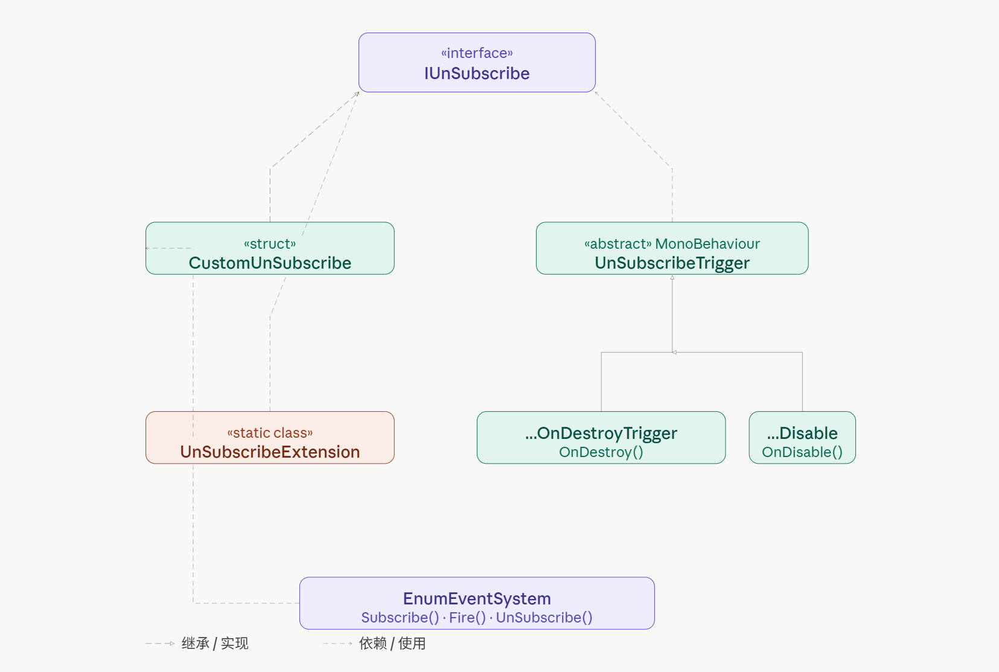

# Unity EventBus：系统之间的解耦利器

先看一个例子，玩游戏的时候角色`go die`了，系统会执行哪些操作呢？比如：UI 显示结算界面，音效播放死亡音，成就系统解锁"初次死亡"，存档系统记录数据……最直接的写法，是在 `Player.Die()` 里把这些系统的引用全塞进来，挨个调用：

```csharp
public class Player : MonoBehaviour
{
    [SerializeField] private UIManager uiManager;
    [SerializeField] private AudioManager audioManager;
    [SerializeField] private AchievementManager achievementManager;

    private void Die()
    {
        uiManager.ShowGameOver();
        audioManager.PlayDeathSound();
        achievementManager.UnlockAchievement("FirstDeath");
        // 每加一个新需求，就要在这里加一行
    }
}
```

虽然能实现功能，但是耦合性非常高：`Player` 不该知道 `UIManager` 长什么样，也不该关心音效怎么播。每次新增一个需要响应死亡事件的系统，都要来改 `Player`——这个类慢慢变成了整个游戏的枢纽，牵一发动全身。

大部分开发者都能想到使用观察者模式：即发布者只管"广播事件发生了"，由订阅者自行决定"要不要监听"。

---

## 观察者模式（Observer）

这个模式的核心是两个角色：发布者不知道谁在监听，**订阅者**自己决定关注什么。Unity 的 `UnityEvent`、C# 的 `event` 关键字，背后都是这个思想。因为这个模式太常用了，这里就不展开讲内容，直接说结论。

使用观察者模式的问题是，虽然发布者不用关注订阅者的信息，但订阅者通常需要发布者的引用才能完成订阅。为了减少这种直接依赖，EventBus 应运而生，它是观察者模式的一种全局变体，引入一个共享的中介者。此时，**发布者和订阅者彼此不再直接引用，完全通过 EventBus 来发布和订阅事件，从而将两者之间的耦合转移为各自与EventBus 的耦合。**

看一下具体是怎么实现的。

---

## 定义事件：枚举

既然EventBus要管理所有的事件，首先需要一套统一的事件标识。常用的由枚举、字符串等方式，为了简单起见，这里直接用枚举

```csharp
public enum GameEvent
{
    OnPlayerDead,
    OnPlayerHurt,
    OnEnemyDead,
    OnScoreChanged,
}
```

每种事件对应一个枚举值，EventBus 用它作为 key 来注册和派发。

---

## EventBus 核心实现

光有事件标识还不够，很多事件需要携带数据——`OnPlayerHurt` 要传伤害值，`OnScoreChanged` 要传新分数，因此传入的参数格式需要比较灵活。

这里用 `Action<object[]>` 统一所有事件的参数格式，配合 `params object[]` 让发布者可以传入任意数量的参数，不需要为每种数据单独写一套类型：

```csharp
public class EnumEventSystem : SingletonManager<EnumEventSystem>
{
    private Dictionary<int, List<Action<object[]>>> _eventTable = new();

    //IConvertible约束，主要是让它必须实现ToInt32方法(enum，int32等，都符合)
    public void Subscribe<T>(T key, Action<object[]> onEvent) where T : IConvertible
    {
        int eventId = key.ToInt32(null);

        if (!_eventTable.TryGetValue(eventId, out var list))
        {
            list = new List<Action<object[]>>();
            _eventTable[eventId] = list;
        }

        list.Add(onEvent);
    }

    public void UnSubscribe<T>(T key, Action<object[]> onEvent) where T : IConvertible
    {
        int eventId = key.ToInt32(null);
        if (_eventTable.TryGetValue(eventId, out var list))
        {
            list.Remove(onEvent);
            if (list.Count == 0)
                _eventTable.Remove(eventId);
        }
    }

    //params: 让方法可以接受可变数量的参数，调用时不必手动构造数组。
    public void Fire<T>(T key, params object[] args) where T : IConvertible
    {
        int eventId = key.ToInt32(null);
        if (_eventTable.TryGetValue(eventId, out var list))
        {
            var snapshot = list.ToArray(); // 快照防止回调中修改订阅列表导致崩溃
            foreach (var handler in snapshot)
                handler?.Invoke(args);
        }
    }
}
```

现在EvnetBus基本功能已经有了，主要就是统一管理事件的订阅和分发，接下来看看还有哪些可以完善的地方

---

## 取消订阅：从手动到自动

最直接的取消订阅方式是在 `OnDestroy` 里手动调用 `UnSubscribe`：

```csharp
private void Start()
{
    EnumEventSystem.Instance.Subscribe(GameEvent.OnPlayerDead, OnPlayerDead);
}

private void OnDestroy()
{
    EnumEventSystem.Instance.UnSubscribe(GameEvent.OnPlayerDead, OnPlayerDead);
}
```

功能上没问题，更优雅的方式是让 `Subscribe` 返回一个**取消订阅令牌**，把"如何取消"的逻辑封装进去：

```csharp
public interface IUnSubscribe
{
    void UnSubscribe();
}

public struct CustomUnSubscribe : IUnSubscribe
{
    private Action _onUnSubscribe;

    public CustomUnSubscribe(Action onUnSubscribe)
    {
        _onUnSubscribe = onUnSubscribe;
    }

    public void UnSubscribe()
    {
        _onUnSubscribe?.Invoke();
        _onUnSubscribe = null; // 防止重复调用
    }
}
```

`Subscribe` 返回 `IUnSubscribe`，调用方拿到 token 调用 `token.UnSubscribe()` 即可，不需要记住订阅时传入的是哪个方法：

```csharp
//修改后的Subscribe函数
public IUnSubscribe Subscribe<T>(T key, Action<object[]> onEvent) where T : IConvertible
{
    int eventId = key.ToInt32(null);

    if (!_eventTable.TryGetValue(eventId, out var list))
    {
        list = new List<Action<object[]>>();
        _eventTable[eventId] = list;
    }

    list.Add(onEvent);

    return new CustomUnSubscribe(() =>
    {
        list.Remove(onEvent);

        if (list.Count == 0)
        {
            _eventTable.Remove(eventId);
        }
    });
}

//调用
var token = EnumEventSystem.Instance.Subscribe(GameEvent.OnPlayerDead, OnPlayerDead);
// 取消时：
token.UnSubscribe();
```

但这只是把手动取消换了一种写法，忘记调用的问题依然存在。真正解决这个问题的，是把取消订阅和 GameObject 的生命周期绑定在一起。

---

## 自动生命周期管理

思路是：让 token 知道它应该在哪个 GameObject 销毁/隐藏时自动取消订阅，而不是依赖开发者手动调用（这部分也是借鉴了QFramework中的实现思路，很好的一个框架，推荐去学习）。

先定义一个抽象基类，持有一组 token，在合适的时机统一取消：

```csharp
public abstract class UnSubscribeTrigger : MonoBehaviour
{
    private readonly HashSet<IUnSubscribe> mUnSubscribes = new HashSet<IUnSubscribe>();

    public IUnSubscribe AddUnSubscribe(IUnSubscribe unSubscribe)
    {
        mUnSubscribes.Add(unSubscribe);
        return unSubscribe;
    }

    public void UnSubscribeAll()
    {
        foreach (var unSubscribe in mUnSubscribes)
            unSubscribe.UnSubscribe();
        mUnSubscribes.Clear();
    }
}

// 在 GameObject 销毁时自动取消
public class UnSubscribeOnDestroyTrigger : UnSubscribeTrigger
{
    private void OnDestroy() => UnSubscribeAll();
}

// 在 GameObject 禁用时自动取消
public class UnSubscribeOnDisableTrigger : UnSubscribeTrigger
{
    private void OnDisable() => UnSubscribeAll();
}
```

再加两个扩展方法，让 token 可以链式绑定到任意 GameObject：

```csharp
public static class UnSubscribeExtension
{
    static T GetOrAddComponent<T>(GameObject go) where T : Component
    {
        var trigger = go.GetComponent<T>();
        if (!trigger) trigger = go.AddComponent<T>();
        return trigger;
    }

    public static IUnSubscribe UnSubscribeWhenGameObjectDestroyed(
        this IUnSubscribe self, GameObject go) =>
        GetOrAddComponent<UnSubscribeOnDestroyTrigger>(go).AddUnSubscribe(self);

    public static IUnSubscribe UnSubscribeWhenGameObjectDestroyed<T>(
        this IUnSubscribe self, T component) where T : Component =>
        self.UnSubscribeWhenGameObjectDestroyed(component.gameObject);

    public static IUnSubscribe UnSubscribeWhenDisabled(
        this IUnSubscribe self, GameObject go) =>
        GetOrAddComponent<UnSubscribeOnDisableTrigger>(go).AddUnSubscribe(self);

    public static IUnSubscribe UnSubscribeWhenDisabled<T>(
        this IUnSubscribe self, T component) where T : Component =>
        self.UnSubscribeWhenDisabled(component.gameObject);
}
```

现在我们的目的完成了，可以直接通过拓展函数实现链式调用，非常优雅。

---

## 完整示例：玩家死亡

现在把所有部分串起来，看看实际使用时有多简洁。

`Player` 死亡时只需要广播，完全不知道谁在监听：

```csharp
public class Player : MonoBehaviour
{
    private void Die()
    {
        EnumEventSystem.Instance.Fire(GameEvent.OnPlayerDead);
        EnumEventSystem.Instance.Fire(GameEvent.OnPlayerHurt, 100);
    }
}
```

各个系统各自订阅，订阅时直接把 token 绑定到自身的 GameObject，对象销毁时自动取消，`OnDestroy` 里什么都不用写：

```csharp
public class UIManager : MonoBehaviour
{
    private void Start()
    {
        EnumEventSystem.Instance
            .Subscribe(GameEvent.OnPlayerDead, _ => ShowGameOver())
            .UnSubscribeWhenGameObjectDestroyed(this);

        EnumEventSystem.Instance
            .Subscribe(GameEvent.OnPlayerHurt, args =>
            {
                int damage = (int)args[0]; // object[] 需要手动转型
                UpdateHP(damage);
            })
            .UnSubscribeWhenGameObjectDestroyed(this);
    }

    private void ShowGameOver() { /* 显示结算界面 */ }
    private void UpdateHP(int damage) { /* 更新血量 UI */ }
}

public class AudioManager : MonoBehaviour
{
    private void Start()
    {
        EnumEventSystem.Instance
            .Subscribe(GameEvent.OnPlayerDead, _ => PlayDeathSound())
            .UnSubscribeWhenGameObjectDestroyed(this);
    }

    private void PlayDeathSound() { /* 播放死亡音效 */ }
}
```

和最开始的写法对比：`Player` 不再持有任何其他系统的引用，新增一个响应系统只需要在那个系统里订阅，`Player` 完全不需要改动；取消订阅由框架自动处理，不再依赖开发者的记忆。

---

## 枚举方案的局限

在示例中能看到，虽然枚举用起来方便，但存在两个比较明显的问题。

**第一，参数类型没有约束，类型安全完全靠自觉。**

`Fire(GameEvent.OnPlayerHurt, 100)` 传的是 `int`，但订阅方写成：

```csharp
EnumEventSystem.Instance.Subscribe(GameEvent.OnPlayerHurt, args =>
{
    string damage = (string)args[0]; // 编译通过，运行时 InvalidCastException
    UpdateHP(damage);
});
```

编译器完全不报错，运行时才崩。更麻烦的是，`object[]` 丢掉了参数的语义——看到 `args[0]`、`args[1]`，你不知道它们分别代表什么，只能去找 `Fire` 的调用方对着数。事件多了以后，这种隐性约定极易出错。

**第二，所有事件集中在一个枚举文件。**

每加一种新事件都要改 `GameEvent.cs`，多人协作时这个文件几乎必然频繁冲突，而且它会越来越长，变成一个谁都要碰、谁都能改的全局文件。

---

## 类型即事件（Type-as-Event）

针对这两个问题，有一种更彻底的解法：**用类型本身标识事件，用 struct 的字段携带参数**。

```csharp
// 每种事件独立定义，参数作为字段，类型和数据绑定在一起
public struct PlayerDeadEvent { }

public struct PlayerHurtEvent
{
    public int Damage;
    public string HitPart;
}
```

每个事件是一个独立的 struct 文件，添加新事件不需要改任何现有文件，多人协作不会冲突。

### TypeEventSystem 实现

内部用 `Dictionary<Type, object>` 存储，以事件类型作为 key，value 实际上是 `Action<T>`，用 object 装箱存储：

```csharp
public class TypeEventSystem : SingletonManager<TypeEventSystem>
{
    private readonly Dictionary<Type, object> _events = new Dictionary<Type, object>();

    public IUnSubscribe Subscribe<T>(Action<T> onEvent) where T : struct
    {
        var type = typeof(T);

        if (_events.TryGetValue(type, out var existing))
            _events[type] = (Action<T>)existing + onEvent;
        else
            _events[type] = onEvent;

        return new CustomUnSubscribe(() => UnSubscribe<T>(onEvent));
    }

    public void UnSubscribe<T>(Action<T> onEvent) where T : struct
    {
        var type = typeof(T);
        if (!_events.TryGetValue(type, out var existing)) return;

        var updated = (Action<T>)existing - onEvent;
        if (updated == null)
            _events.Remove(type);
        else
            _events[type] = updated;
    }

    public void Fire<T>(T eventData) where T : struct
    {
        var type = typeof(T);
        if (_events.TryGetValue(type, out var handler))
            ((Action<T>)handler)?.Invoke(eventData);
    }
}
```

`where T : struct` 约束保证事件类型是值类型，避免误用引用类型。`Action<T>` 的组合和拆分用 C# 委托的 `+`/`-` 运算符，和 `EnumEventSystem` 里用 `List` 管理不同，这里更紧凑。

### 使用对比

订阅时，参数直接以强类型字段拿到，不需要任何转型：

```csharp
public class UIManager : MonoBehaviour
{
    private void Start()
    {
        TypeEventSystem.Instance
            .Subscribe<PlayerHurtEvent>(e =>
            {
                UpdateHP(e.Damage);   // 强类型，IDE 有提示，不会写错
                Debug.Log(e.HitPart); // 字段名即语义，一目了然
            })
            .UnSubscribeWhenGameObjectDestroyed(this);

        TypeEventSystem.Instance
            .Subscribe<PlayerDeadEvent>(_ => ShowGameOver())
            .UnSubscribeWhenGameObjectDestroyed(this);
    }
}
```

派发时，参数直接写在 struct 初始化里：

```csharp
TypeEventSystem.Instance.Fire(new PlayerHurtEvent
{
    Damage = 30,
    HitPart = "Head"
});
```

类型传错了会直接编译报错，根本不存在运行时类型转换失败的问题。

从长远来看，类型即事件方案在可维护性上有明显优势。如果项目规模不大、事件数量可控，枚举方案已经够用；一旦团队协作、事件数量增加，切换到类型即事件能省去很多隐性 bug 的排查时间。

---

## 注意：子线程调用的问题

这套 EventBus 有一个需要留意的地方：**`Fire` 在哪个线程调用，回调就在哪个线程执行**。

大多数情况下不是问题，但如果你在 `Task.Run` 或网络回调等子线程里调用 `Fire`，订阅者里一旦触碰 Unity 对象（`transform`、Text、Image 等），会直接报错：`can only be called from the main thread`。

常见的解决方案是使用**`MainThreadDispatcher`**，即派发的时候不直接调用，而是用队列缓冲，在主线程中统一派发

```csharp
public class MainThreadDispatcher : MonoBehaviour
{
    private static readonly Queue<Action> _queue = new Queue<Action>();

    private void Update()
    {
        while (_queue.Count > 0)
            _queue.Dequeue()?.Invoke();
    }

    public static void Enqueue(Action action) => _queue.Enqueue(action);
}
```

当然这只是一个简单的思路，代码并不完善。

另外需要注意，`EnumEventSystem` 和 `TypeEventSystem` 内部的 `Dictionary` 和 `List` 均非线程安全。并发 Subscribe / Unsubscribe / Fire 存在竞争条件，可能导致数据损坏或异常。这两个系统本身设计为主线程使用，如果确实需要跨线程，建议配合上面的 `MainThreadDispatcher`（使用 `ConcurrentQueue` 替换 `Queue`），而不是直接在子线程调用 `Fire`。

---

## 小结

总结一下大概的设计思路

| 层级 | 职责 | 设计模式 |
|---|---|---|
| `GameEvent` 枚举 | 统一定义事件类型标识 | — |
| `EnumEventSystem` | 管理订阅关系，派发事件 | 观察者模式 — 发布者与订阅者解耦 |
| `IUnSubscribe` 令牌 | 封装取消订阅逻辑 | 命令模式 — 把操作封装成对象 |
| `UnSubscribeTrigger` | 绑定取消订阅到 GameObject 生命周期 | 组件模式 — 动态挂载行为 |
| 各业务系统 | 自行订阅、响应 | 依赖倒置 — 依赖事件抽象而非具体系统 |

结构图如下



这是Unity游戏框架中的第二篇文章，第一篇：[ObjectPool:从朴素写法到Unity 对象池框架](https://zhuanlan.zhihu.com/p/2037565166997479627)

下一篇会讲解资源框架相关内容


