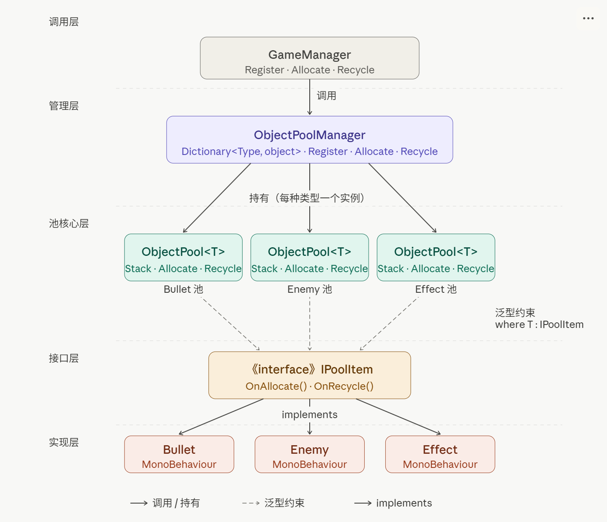

# Unity 对象池

对象池在很多地方都会使用，比如FPS游戏中的子弹，开枪时 `Instantiate`，击中时 `Destroy`，逻辑直观，写起来也方便，但显而易见，这会导致频繁的GC，很消耗性能。

对象池的思路很简单：不销毁，改成禁用，放回一个"备用仓库"里，下次要用的时候再从仓库里面取出来，只需要注意对象的状态，回收的时候重置。

---

## 直觉的写法

最直觉的做法是自己用 `List` 攒一个池：

```csharp
public class BulletPool : MonoBehaviour
{
    [SerializeField] private Bullet bulletPrefab;
    private List<Bullet> _pool = new List<Bullet>();

    public Bullet Get()
    {
        if (_pool.Count > 0)
        {
            var b = _pool[0];
            _pool.RemoveAt(0);
            b.gameObject.SetActive(true); // 调用方要自己记得激活
            return b;
        }
        return Instantiate(bulletPrefab);
    }

    public void ReturnToPool(Bullet bullet)
    {
        bullet.gameObject.SetActive(false); // 调用方要自己记得禁用
        _pool.Add(bullet);
    }
}
```

能跑，但存在不少问题：

- **对象不知道自己被回收了**。如果子弹有计时器、粒子效果、速度状态，回收时要重置，你得在 `ReturnToPool` 里手动处理——这意味着 `BulletPool` 要知道 `Bullet` 的内部细节，耦合严重。
- **每种对象都要写一个池**。`EnemyPool`、`EffectPool`、`BulletPool`……会存在大量的重复代码。
- **没有统一入口**。各系统自己持有池的引用，项目大了以后引用关系非常乱。

为了解决这些问题，我们做一个简单的对象池框架。

---

## 第一步：用接口建立契约

核心问题是：池需要在**取出**和**回收**两个时机通知对象，但池不应该知道对象的具体类型。

接口正好解决这个问题：

```csharp
public interface IPoolItem
{
    void OnAllocate();  // 从池中取出时调用
    void OnRecycle();   // 回收进池时调用
}
```

为什么是接口而不是基类？因为池里的对象大概率是 `MonoBehaviour`，继承位已经被占了。接口不破坏继承链，任何类都能实现它。

有了这个约定，对象自己负责自己的初始化和清理，池完全不需要关心内部细节。看起来挺合理，其实是使用了**依赖倒置**的思路：`ObjectPool<T>` 只依赖 `IPoolItem` 这个抽象，而不是任何具体类型，`Bullet`只需要继承并实现接口。

> 依赖倒置： 高层模块不要依赖低层模块，双方都应该依赖抽象。不使用设计模式的做法是 高层 → 低层，通过依赖倒置 高层 → 抽象 ← 低层，高层依赖抽象，低层实现抽象

---

## 第二步：泛型池 ObjectPool\<T\>

有了接口约束，池的实现就可以做成泛型的，一套代码复用所有类型。

用 `Stack<T>` 来缓存对象，`Push`/`Pop` 都是 O(1)复杂度，也不会像 `List` 那样在头部删除时移动元素。同时栈的 LIFO（后进先出）特性，刚回收的对象，可能立马取出，缓存命中率更高。

创建和销毁的逻辑通过 `Func<T>` 和 `Action<T>` 注入，池本身不依赖任何具体类型：

```csharp
public class ObjectPool<T> where T : IPoolItem
{
    private readonly Stack<T> _stack = new Stack<T>();
    private readonly Func<T> _onCreate;
    private readonly Action<T> _onDestroy;

    public ObjectPool(Func<T> onCreate, Action<T> onDestroy = null)
    {
        _onCreate = onCreate;
        _onDestroy = onDestroy;
    }

    public T Allocate()
    {
        var item = _stack.Count > 0 ? _stack.Pop() : _onCreate();
        item.OnAllocate();
        return item;
    }

    public void Recycle(T item)
    {
        item.OnRecycle();
        _stack.Push(item);
    }
}
```

`Allocate` 的逻辑很简单：池里有就直接拿，没有就调用 `_onCreate` 创建一个新的，然后触发 `OnAllocate`。`Recycle` 先触发 `OnRecycle` 让对象自己清理状态，再推回栈里。

这里的 `Func<T>` 和 `Action<T>` 是**策略模式（Strategy）**的轻量应用。"怎么创建"和"怎么销毁"是两块可变的行为，通过构造函数注入而不是写死在类里，`ObjectPool<T>` 本身只处理"什么时候创建/回收"这个稳定的核心逻辑。换句话说，池不知道也不需要知道 `Bullet` 长什么样——创建它的 `Instantiate` 逻辑、销毁它的 `Destroy` 逻辑，都由外部决定，池只是个调度器。这是让泛型池真正做到零依赖的关键。

---

## 第三步：统一管理 ObjectPoolManager

现在还有一个问题：游戏里通常有子弹池、特效池、敌人池，如果每个系统都自己持有 `ObjectPool<T>` 的实例，引用散落各处，很难维护。

用一个管理类统一注册和访问所有池：

```csharp
public class ObjectPoolManager
{
    private readonly Dictionary<Type, object> _pools = new Dictionary<Type, object>();

    public void Register<T>(Func<T> onCreate, Action<T> onDestroy = null) where T : IPoolItem
    {
        _pools[typeof(T)] = new ObjectPool<T>(onCreate, onDestroy);
    }

    public T Allocate<T>() where T : IPoolItem
    {
        return GetPool<T>().Allocate();
    }

    public void Recycle<T>(T item) where T : IPoolItem
    {
        GetPool<T>().Recycle(item);
    }

    private ObjectPool<T> GetPool<T>() where T : IPoolItem
    {
        return (ObjectPool<T>)_pools[typeof(T)];
    }
}
```

`Dictionary<Type, object>` 用类型本身作为 key，`Allocate<T>()` 和 `Recycle<T>()` 通过泛型参数自动定位到正确的池。调用方只需要知道类型，不需要持有任何池的引用。

这里使用Type作为key虽然不能满足一些特殊场景，但大部分情况下都适用了。当然这只是一个非常简单的框架，用来展示一些设计思想，可以根据需要进行拓展，比如将`ObjectPoolManager`设计为单例类，添加对象池状态展示等

---

## 完整示例：子弹

现在有了一个简单的对象池，看看实际怎么用。

**实现接口**

```csharp
public class Bullet : MonoBehaviour, IPoolItem
{
    private ObjectPoolManager _manager;

    public void Init(ObjectPoolManager manager) => _manager = manager;

    public void OnAllocate()
    {
        gameObject.SetActive(true);
    }

    public void OnRecycle()
    {
        gameObject.SetActive(false);
        // 在这里重置速度、状态、粒子效果等
    }

    private void OnTriggerEnter(Collider other)
    {
        _manager.Recycle(this); // 碰撞时自己决定回收时机
    }
}
```

这里有个值得注意的设计：子弹自己持有 `_manager` 的引用，在 `OnTriggerEnter` 里主动归还自己。对象知道自己的生命周期——什么时候该回收，由对象自己判断，而不是让外部系统来盯着。

**注册与使用**

```csharp
public class GameManager : MonoBehaviour
{
    [SerializeField] private Bullet bulletPrefab;

    private ObjectPoolManager _poolManager;

    private void Awake()
    {
        _poolManager = new ObjectPoolManager();
        _poolManager.Register<Bullet>(
            onCreate: () => Instantiate(bulletPrefab).GetComponent<Bullet>(),
            onDestroy: b => Destroy(b.gameObject)
        );
    }

    public void FireBullet(Vector3 position, Vector3 direction)
    {
        var bullet = _poolManager.Allocate<Bullet>();
        bullet.transform.position = position;
        // 设置方向、速度等...
    }
}
```

`Register` 只调用一次，之后随时 `Allocate`，不再有 `Instantiate`/`Destroy` 的开销。

---

## 关于 Unity 内置方案

Unity 2021 起内置了 `UnityEngine.Pool.ObjectPool<T>`，不想自己写的话开箱即用。

自定义这套实现的价值在于：`IPoolItem` 接口让对象行为有明确约束，`ObjectPoolManager` 统一管理多类型池，整个系统的边界更清晰，适合有一定规模的项目。两者思路相同，按团队习惯选择就好。

---

## 小结

整体架构如下



图中展示了四个层次的依赖关系：

**调用层 → 管理层**：`GameManager` 只和 `ObjectPoolManager` 打交道，不直接接触具体的池实例。

**管理层 → 池核心层**：`ObjectPoolManager` 内部用 `Dictionary<Type, object>` 持有多个 `ObjectPool<T>` 实例，每种类型对应一个独立的池。

**池核心层 → 接口层**（虚线）：泛型约束 `where T : IPoolItem`，`ObjectPool<T>` 只依赖接口抽象，不依赖任何具体类型。

**接口层 → 实现层**：`Bullet`、`Enemy`、`Effect` 各自实现 `IPoolItem`，自己负责 `OnAllocate` 和 `OnRecycle` 的清理逻辑，池完全不需要知道它们的内部细节。

并且使用了依赖倒置，策略模式等设计思想。
