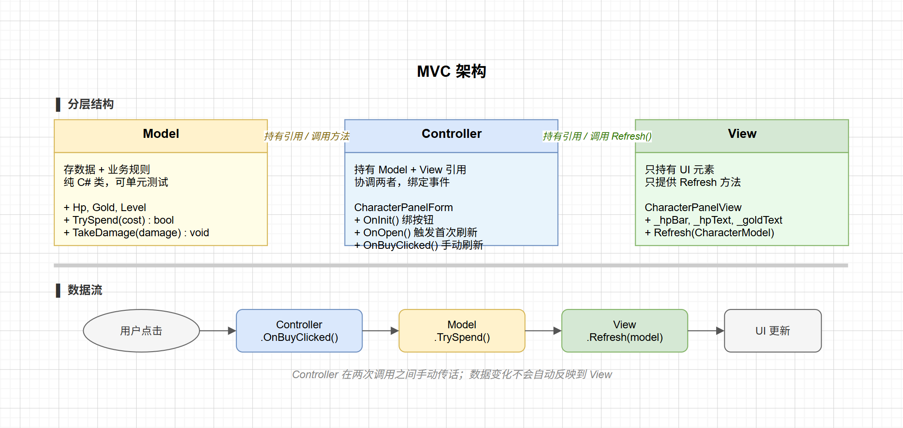
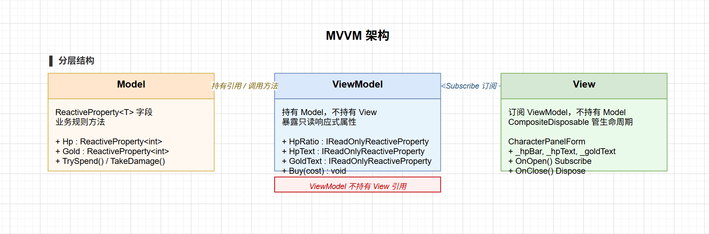
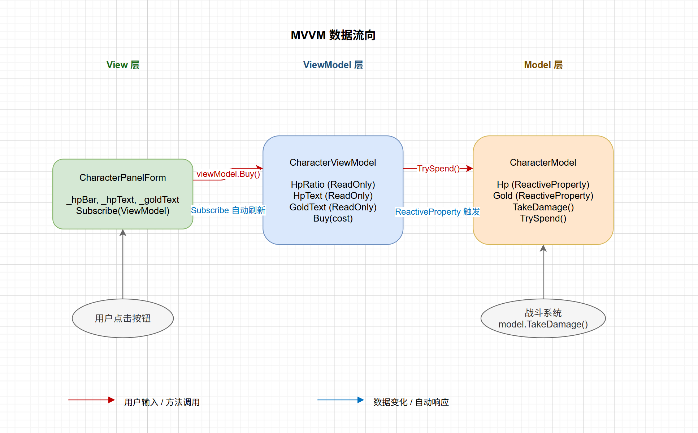
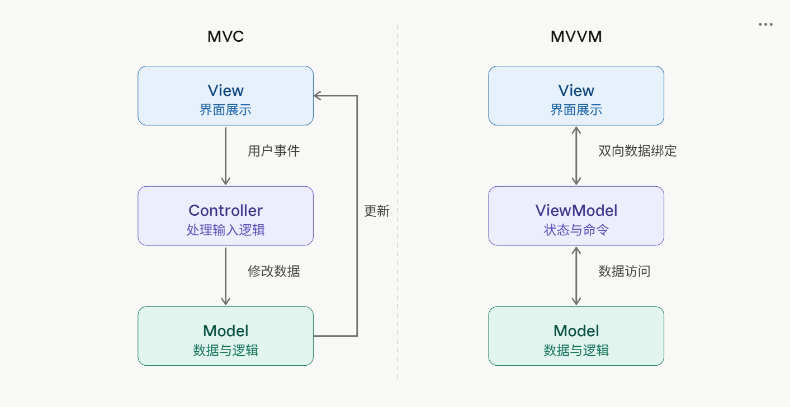

# Unity UI 框架：从界面管理到代码架构（二）

上一篇解决的是界面管理问题：`UIManager` 负责打开、关闭、缓存每个界面，每个界面通过 `IUIForm` 约定生命周期。但管理器管的是"哪些界面开着"，不管"界面内部的代码怎么组织"。

写几个简单界面还好，一旦界面复杂起来，比如角色属性面板要显示 HP 条、金币、等级，还有购买按钮——代码很容易变成这样：

```csharp
public class CharacterPanelForm : UIFormBasic
{
    [SerializeField] private Slider _hpBar;
    [SerializeField] private Text _hpText;
    [SerializeField] private Text _goldText;

    private int _hp;
    private int _maxHp = 100;
    private int _gold;

    public override void OnOpen(IUIFormData data = null)
    {
        base.OnOpen(data);
        _hp = GameManager.Instance.PlayerHp;
        _gold = GameManager.Instance.PlayerGold;
        _hpBar.value = (float)_hp / _maxHp;
        _hpText.text = $"{_hp} / {_maxHp}";
        _goldText.text = _gold.ToString();
    }

    public void OnBuyClicked()
    {
        int cost = 100;
        if (_gold >= cost)
        {
            _gold -= cost;
            GameManager.Instance.PlayerGold = _gold;
            _goldText.text = _gold.ToString();
            // 还要播音效、更新成就……
        }
    }
}
```

虽然能运行，但问题也很明显：

- **数据和显示耦合**：`_hp`、`_gold` 既是业务数据又被 UI 直接操作，换一套显示方案要改这整个类
- **逻辑无法复用**：购买扣钱的逻辑和刷新金币文字混在同一个方法里，别的界面也要购买时只能复制
- **没法单独测试**：想验证"金币不足时无法购买"，必须把整个 UI 场景跑起来

三个问题的根源是同一件事：**数据、显示、逻辑没有分离**。MVC 就是为了解决这个问题而来的。

---

## MVC：把三件事分开

### 第一步：抽出 Model

把数据和业务规则从 MonoBehaviour 里剥出来，做成一个纯 C# 类：

```csharp
public class CharacterModel
{
    public int Hp { get; private set; }
    public int MaxHp { get; private set; }
    public int Gold { get; private set; }
    public int Level { get; private set; }

    public CharacterModel(int maxHp, int gold, int level)
    {
        MaxHp = maxHp;
        Hp = maxHp;
        Gold = gold;
        Level = level;
    }

    public bool TrySpend(int cost)
    {
        if (Gold < cost) return false;
        Gold -= cost;
        return true;
    }

    public void TakeDamage(int damage)
    {
        Hp = Mathf.Max(0, Hp - damage);
    }
}
```

`TrySpend` 和 `TakeDamage` 是纯逻辑，没有任何 Unity API，可以单独写单元测试——不需要启动场景，直接 `new CharacterModel(...)` 就能测。

### 第二步：View 只管显示

View 只持有 UI 元素引用，只提供一个刷新方法，不接触任何业务数据：

```csharp
public class CharacterPanelView : MonoBehaviour
{
    [SerializeField] private Slider _hpBar;
    [SerializeField] private Text _hpText;
    [SerializeField] private Text _goldText;

    public void Refresh(CharacterModel model)
    {
        _hpBar.value = (float)model.Hp / model.MaxHp;
        _hpText.text = $"{model.Hp} / {model.MaxHp}";
        _goldText.text = model.Gold.ToString();
    }
}
```

View 不知道数据从哪来，也不知道业务规则是什么，只负责"把 Model 里的数据画出来"。

### 第三步：Controller 连接两者

Controller 就是 `UIFormBasic` 的子类——`OnInit` 里绑按钮，`OnOpen` 里传入 `Model` 并触发刷新：

```csharp
// 传参用的数据类
public class CharacterPanelData : IUIFormData
{
    public CharacterModel Model;
}

[UIForm("CharacterPanel", UILevel.Normal)]
public class CharacterPanelForm : UIFormBasic
{
    private CharacterPanelView _view;
    private CharacterModel _model;

    public override void OnInit(string formAssetName, Transform transform)
    {
        base.OnInit(formAssetName, transform);
        _view = GetComponent<CharacterPanelView>();
        GetComponentInChildren<Button>().onClick.AddListener(OnBuyClicked);
    }

    public override void OnOpen(IUIFormData data = null)
    {
        base.OnOpen(data);
        _model = (data as CharacterPanelData)?.Model;
        _view.Refresh(_model);
    }

    private void OnBuyClicked()
    {
        if (_model.TrySpend(100))
            _view.Refresh(_model);  // 购买成功后手动刷新
    }
}
```

三层职责一目了然：Model 管数据，View 管显示，Controller 管协调。前面的三个问题都解决了：数据独立可测，购买逻辑在 Model 里可复用，View 只做渲染，结构如下：



---

## MVC 的局限

之前的逻辑是面板打开的时候刷新，频率都不高。但如果角色在战斗中持续受伤，HP 实时变化，面板需要实时更新，Controller 怎么知道该刷新了？

**做法一：给 Model 加 `event`**

```csharp
public class CharacterModel
{
    public event Action OnChanged;

    public void TakeDamage(int damage)
    {
        Hp = Mathf.Max(0, Hp - damage);
        OnChanged?.Invoke();
    }
}
```

```csharp
// Controller 订阅
_model.OnChanged += () => _view.Refresh(_model);
```

但还是存在问题：单一属性变了，会导致所有数据都需要重新设置，比如 HP 变了会连金币文字也一起重新设置，哪怕金币根本没变。

**做法二：每个字段单独加事件**

`OnHpChanged`、`OnGoldChanged`、`OnLevelChanged`……字段一多，Controller 要订阅一堆事件，Model、Controller、View 三处同步修改，加一个新字段就要动三个文件。

这两种做法都没有根治问题，因为 **Controller 始终是中间人**——它既要响应用户输入，又要协调数据和显示的同步，两件事混在一起导致职责边界模糊。

真正的解法是：**让 View 直接"盯着"数据，数据一变 View 自动更新，不需要 Controller 在中间传话**。这就是 MVVM 的思路。



---

## MVVM：让数据自己开口说话

MVVM 把 MVC 的 Controller 换了一种思路：不再让 Controller 在 Model 和 View 之间传话，而是让数据直接"推送"——数据一变，关注它的地方自动更新，中间不需要任何"刷新"调用（类似event，但比event方便）。

三层各有明确职责：**Model** 存数据和业务规则，但字段改成能通知的形式；**ViewModel** 把 Model 的原始数据转换成 View 需要的格式并暴露出来，不持有任何 View 引用；**View** 自己订阅 ViewModel 的属性，数据变了 UI 自动刷新，不需要被动等人来推。

先实现字段值发生改变就通知的功能。

### ReactiveProperty：赋值即通知

MVC 做法二的思路是对的——给 Model 加 event，数据变了主动通知。但写起来很繁琐：每个字段要单独声明一个 event，当字段很多的时候，无论是声明还是订阅event，都变得很麻烦。

`ReactiveProperty<T>` 把这些统一封装进一个泛型类，赋值后自动通知，`Subscribe` 返回 `IDisposable` 让退订可以统一管理：

```csharp
var hp = new ReactiveProperty<int>(100);

hp.Subscribe(value => Debug.Log($"HP: {value}"));  // 立即打印 "HP: 100"

hp.Value = 80;  // 自动打印 "HP: 80"，不需要手动触发任何事件
```

实现思路很直接：内部存一个值 `_value` 和一个订阅者列表；`Value` 的 setter 在赋值后遍历列表逐一回调；`Subscribe` 把回调加入列表、立即推送当前值，并返回一个"把自己从列表移除"的 `IDisposable`。

```csharp
public class ReactiveProperty<T>
{
    private T _value;
    private readonly List<Action<T>> _subscribers = new();

    public T Value
    {
        get => _value;
        set { _value = value; foreach (var s in _subscribers) s(_value); }
    }

    public ReactiveProperty(T value = default) => _value = value;

    public IDisposable Subscribe(Action<T> onNext)
    {
        _subscribers.Add(onNext);
        onNext(_value);  // 订阅时立即推送当前值，不需要额外的初始化调用
        return new Unsub(() => _subscribers.Remove(onNext));
    }

    private class Unsub : IDisposable
    {
        readonly Action _fn;
        public Unsub(Action fn) => _fn = fn;
        public void Dispose() => _fn();
    }
}
```

再加一个 `CompositeDisposable` 统一管理多个订阅的生命周期：

```csharp
public class CompositeDisposable : IDisposable
{
    private readonly List<IDisposable> _list = new();
    public void Add(IDisposable d) => _list.Add(d);
    public void Dispose() { _list.ForEach(d => d.Dispose()); _list.Clear(); }
}
```

如果不想自己维护，GitHub 上的 [R3](https://github.com/Cysharp/R3) 提供了功能完整的实现，API 和这里结构兼容，并且功能丰富很多，推荐直接使用现成的。

把 `CharacterModel` 的字段从 `int` 换成 `ReactiveProperty<int>`，之后每次赋值就自动带上了通知：

```csharp
public class CharacterModel
{
    public ReactiveProperty<int> Hp { get; } = new(100);
    public ReactiveProperty<int> MaxHp { get; } = new(100);
    public ReactiveProperty<int> Gold { get; } = new(500);
    public ReactiveProperty<int> Level { get; } = new(1);

    public bool TrySpend(int cost)
    {
        if (Gold.Value < cost) return false;
        Gold.Value -= cost;
        return true;  // Gold 变化，订阅者自动收到
    }

    public void TakeDamage(int damage)
    {
        Hp.Value = Mathf.Max(0, Hp.Value - damage);
        // 不需要 OnChanged?.Invoke()，订阅者自动感知
    }
}
```

### ViewModel：数据转换层

Model 已经能发通知了，View 直接订阅 `model.Hp` 不就行了？还有个问题：Model 里存的是 `int`，View 需要的是 `float` 比例和格式化字符串，直接订阅会把 View 和 Model 的数据格式耦合死——Model 改了字段类型，View 也得跟着改。ViewModel 站在中间做这层转换：

```csharp
public class CharacterViewModel
{
    private readonly CharacterModel _model;

    public readonly ReactiveProperty<float> HpRatio = new();
    public readonly ReactiveProperty<string> HpText = new();
    public readonly ReactiveProperty<string> GoldText = new();

    public CharacterViewModel(CharacterModel model)
    {
        _model = model;

        // 订阅 Model，把原始 int 转成 View 需要的类型写入派生属性
        model.Hp.Subscribe(hp =>
        {
            HpRatio.Value = (float)hp / model.MaxHp.Value;
            HpText.Value = $"{hp} / {model.MaxHp.Value}";
        });

        model.Gold.Subscribe(g => GoldText.Value = g.ToString());
    }

    // 用户操作只通过方法进来，不能绕过 ViewModel 直接改 Model
    public void Buy(int cost) => _model.TrySpend(cost);
}
```

ViewModel 不持有任何 View 的引用——它不知道谁在订阅它，也不在乎。这和 MVC 的 Controller 形成对比：Controller 持有 View 引用并主动调 `Refresh`；**ViewModel 只管暴露数据，由 View 自己决定订阅什么。**

### View：订阅替代刷新

`UIFormBasic` 子类在 `OnOpen` 里订阅 ViewModel，用 `CompositeDisposable` 统一管理所有订阅的生命周期，`OnClose` 一行释放：

```csharp
public class CharacterPanelData : IUIFormData
{
    public CharacterViewModel ViewModel;
}

[UIForm("CharacterPanel", UILevel.Normal)]
public class CharacterPanelForm : UIFormBasic
{
    [SerializeField] private Slider _hpBar;
    [SerializeField] private Text _hpText;
    [SerializeField] private Text _goldText;

    private CharacterViewModel _viewModel;
    private CompositeDisposable _disposables;

    public override void OnInit(string formAssetName, Transform transform)
    {
        base.OnInit(formAssetName, transform);
        GetComponentInChildren<Button>().onClick.AddListener(OnBuyClicked);
    }

    public override void OnOpen(IUIFormData data = null)
    {
        base.OnOpen(data);
        _viewModel = (data as CharacterPanelData)?.ViewModel;
        _disposables = new CompositeDisposable();

        // 订阅：数据一变，UI 自动刷新，不需要手动调 Refresh
        _disposables.Add(_viewModel.HpRatio.Subscribe(v => _hpBar.value = v));
        _disposables.Add(_viewModel.HpText.Subscribe(v => _hpText.text = v));
        _disposables.Add(_viewModel.GoldText.Subscribe(v => _goldText.text = v));
    }

    public override void OnClose()
    {
        _disposables?.Dispose();  // 一行退订所有，不会内存泄漏
    }

    private void OnBuyClicked() => _viewModel.Buy(100);
}
```




整个流向是：用户点按钮 → `View` 调 `ViewModel.Buy()` → `ViewModel` 调 `Model.TrySpend()` → `Model.Gold.Value` 减少 → `GoldText` 订阅自动触发 → `_goldText.text` 更新。界面代码里没有任何"刷新"调用，数据变化自己找到显示层。

---

## 完整示例

把三层装配起来，从外部传入数据：

```csharp
// 游戏启动时创建 Model 和 ViewModel
var model = new CharacterModel(maxHp: 200, gold: 500, level: 5);
var viewModel = new CharacterViewModel(model);

// 打开面板
UIManager.Instance.OpenUIForm<CharacterPanelForm>(
    new CharacterPanelData { ViewModel = viewModel }
);

// 战斗系统直接操作 Model
model.TakeDamage(30);   // HP 条自动更新，CharacterPanelForm 不需要任何改动
model.TakeDamage(50);
```

战斗系统调 `TakeDamage`，完全不需要知道 `CharacterPanelForm` 的存在。HP 条的更新路径是：`model.Hp.Value` 变化 → `HpRatio` 和 `HpText` 的订阅触发 → `Slider` 和 `Text` 自动刷新。整个链路不经过任何 `Controller`。

---

## 小结

两套架构各有适用场景。



MVC 适合交互频率低的界面：设置页、确认弹窗，用户点一次改一次，手动 `Refresh` 完全够用，上 MVVM 是过度设计。

MVVM 适合数据实时变化的界面：战斗 HUD、实时统计，HP 随伤害跳动、Buff 层数变化，订阅机制比手写刷新干净得多——数据在哪改、改多少次，View 自己感知，不需要任何中间人传话。

两者可以在同一个项目里混用，选的标准只有一个：**这个数据会不会在界面打开期间自己变？** 会的用 MVVM，不会的 MVC 就够了，对于一些简单的界面，直接写在一个类就行，没必要过渡设计。

这是Unity UI框架的第二篇内容，上一篇：[Unity UI 框架：从界面管理到代码架构（一）](https://zhuanlan.zhihu.com/p/2045192611028276236)

下一篇预计讲HFSM层级状态机的概念和使用案例。最近也在抽空整理系列文章的代码，整理好了会第一时间放到Github上。
