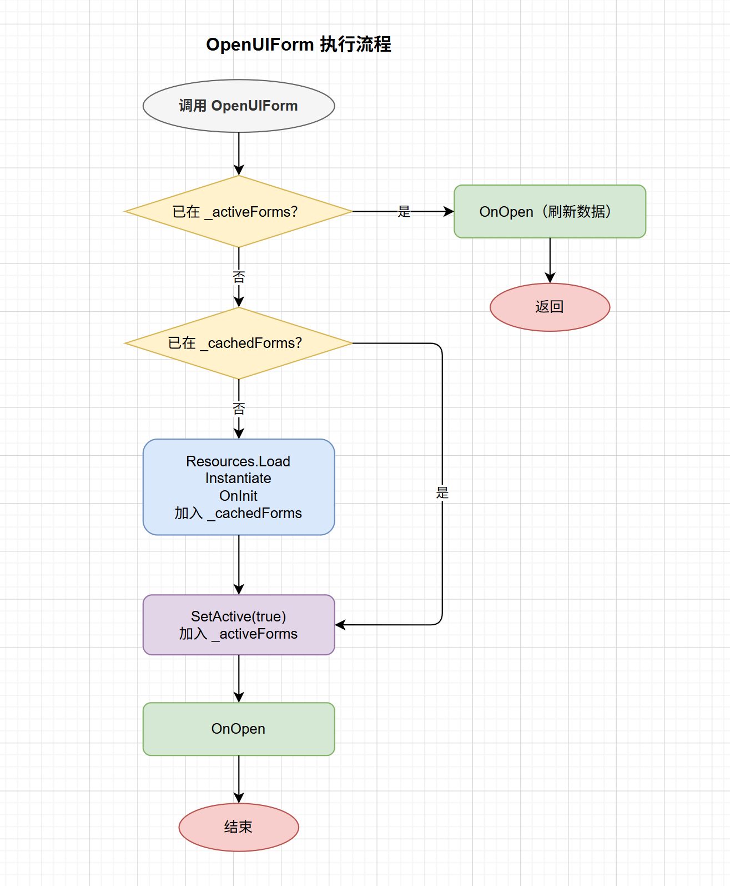
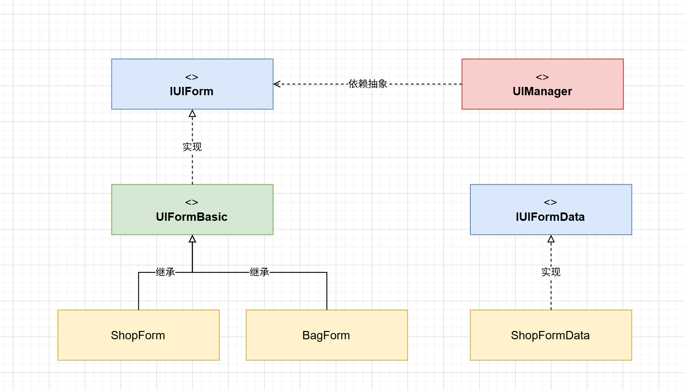

# Unity UI 框架：从界面管理到代码架构（一）

Unity中，UI是比较基础的一项内容，但我们在做项目的时候，经常能够碰到UI 界面很多的情况，比如：主菜单、背包、商店、技能树、暂停菜单……这种情况下，每个界面的打开和关闭逻辑都散落在各自的按钮脚本里，比如下面这种：

```csharp
public class ShopButton : MonoBehaviour
{
    [SerializeField] private GameObject shopPanelPrefab;
    private GameObject _shopInstance;

    public void Open()
    {
        _shopInstance = Instantiate(shopPanelPrefab);
    }

    public void Close()
    {
        Destroy(_shopInstance);
    }
}
```

虽然能运行，但存在以下问题：

- **没有统一入口**：打开和关闭 UI 的调用分散在很多地方，没有人知道"某个UI界面现在有没有开着"。
- **重复实例化**：每次打开都 `Instantiate`，关闭就 `Destroy`，会一直产生 GC。
- **层级失控**：不同界面之间的层级顺序容易出错，比如弹窗和主界面。

解决上述问题最好的做法是使用`UIManager`对UI进行统一管理。

---

## 第一步：用接口定规则

`UIManager` 要管理所有界面，但它不能依赖每个具体的界面类，很明显需要定义一个接口，来代表具体的`UIForm`

```csharp
public interface IUIForm
{
    string FormAssetName { get; set; }
    Transform Transform { get; set; }

    //首次实例化时调，只调一次。
    void OnInit(string formAssetName, Transform transform);
    void OnOpen(IUIFormData uiFormData = null);
    void OnClose();
    //场景切换前销毁时调。释放较大的资源、取消事件订阅。
    void OnRecycle();
}
```

> **依赖倒置**：`UIManager` 只依赖 `IUIForm` 这个抽象，不依赖任何具体界面类，后续比如`ShopForm`、`BagForm` 各自实现接口，`UIManager`完全不需要知道它们的存在。

---

## 第二步：加一个模板基类

接口定好了，但实现起来还是比较麻烦，因为继承接口的类需要实现它的所有方法，但`OnClose`、`OnRecycle`等并非所有情况下都用得上。

解决方案是加一个抽象基类，提供四个方法的默认实现，子类只 `override` 自己需要的：

```csharp
public abstract class UIFormBasic : MonoBehaviour, IUIForm
{
    public string FormAssetName { get; set; }
    public Transform Transform { get; set; }
    protected IUIFormData _uiFormData;

    public virtual void OnInit(string formAssetName, Transform transform)
    {
        FormAssetName = formAssetName;
        Transform = transform;
    }

    public virtual void OnOpen(IUIFormData uiFormData = null)
    {
        _uiFormData = uiFormData;
    }

    public virtual void OnClose() { }
    public virtual void OnRecycle() { }
}
```

有了基类，实现一个新界面就很方便了：

```csharp
public class ShopForm : UIFormBasic
{
    public override void OnOpen(IUIFormData uiFormData = null)
    {
        base.OnOpen(uiFormData);
        // 刷新商品列表
    }

    public override void OnClose()
    {
        // 停止滚动动画
    }
    // OnInit 和 OnRecycle 不需要就不写
}
```

---

## 第三步：管理器`UIManager`

`UIManager` 要解决的是前面提到的三个问题：统一入口、缓存复用、层级管理。

所有打开、关闭 UI 的调用都通过它统一管理， 比如`UIManager.Instance.OpenUIForm(...)`、`UIManager.Instance.CloseUIForm(...)`。

### 层级系统

层级混乱的根源是所有界面都挂在同一个容器下。解决方案是分层——弹窗挂弹窗层，主界面挂主界面层，层级顺序由容器节点的 Hierarchy 顺序决定，完全可控。如果觉得这样分层还不够，也可以通过设置`sortingOrder`精细控制

```csharp
public enum UILevel { Normal, Popup, Item }
```

`UIManager` 启动时自动创建对应的分层子节点：

```csharp
private void CreateLevelRoots()
{
    foreach (UILevel level in Enum.GetValues(typeof(UILevel)))
    {
        var go = new GameObject(level.ToString(), typeof(RectTransform));
        go.transform.SetParent(transform, false);
        var rect = go.GetComponent<RectTransform>();
        rect.anchorMin = Vector2.zero;
        rect.anchorMax = Vector2.one;
        rect.offsetMin = rect.offsetMax = Vector2.zero;
        _levelRoots[level] = go.transform;
    }
}
```

### 两级缓存

关于频繁`Destroy`引发的`GC`问题，可以通过字典缓存解决：

```csharp
private Dictionary<string, IUIForm> _activeForms = new();   // 当前可见
private Dictionary<string, IUIForm> _cachedForms = new();   // 已实例化，暂时隐藏
```

关闭界面时不销毁，只是 `SetActive(false)` 然后从 `_activeForms` 移出，留在 `_cachedForms`；再次打开时从缓存取出来 `SetActive(true)` 就能用，不需要重新实例化。真正销毁只发生在场景切换前调 `ClearCache` 的时候。

### OpenUIForm

把层级和缓存逻辑结合起来，`OpenUIForm` 分三种情况处理：



具体实现如下：

```csharp
public void OpenUIForm(string formAssetName, UILevel level = UILevel.Normal,
    IUIFormData uiFormData = null)
{
    // 已经在屏幕上：只刷新数据
    if (_activeForms.TryGetValue(formAssetName, out var activeForm))
    {
        activeForm.OnOpen(uiFormData);
        return;
    }

    if (!_cachedForms.TryGetValue(formAssetName, out var form))
    {
        // 首次打开：加载、实例化、初始化
        string path = Path.Combine(_rootPath, level.ToString(), formAssetName);
        var prefab = Resources.Load<GameObject>(path);
        var go = Instantiate(prefab, _levelRoots[level]);
        form = go.GetComponent<IUIForm>();
        form.OnInit(formAssetName, go.transform);
        _cachedForms[formAssetName] = form;
    }

    // 从缓存取出或刚实例化：激活并打开
    form.Transform.gameObject.SetActive(true);
    _activeForms[formAssetName] = form;
    form.OnOpen(uiFormData);
}
```

关闭和清理：

```csharp
public void CloseUIForm(IUIForm form)
{
    if (form == null || !_activeForms.ContainsKey(form.FormAssetName)) return;

    form.OnClose();
    form.Transform.gameObject.SetActive(false);
    _activeForms.Remove(form.FormAssetName);
}

public void ClearCache()
{
    CloseAllUI();
    foreach (var form in _cachedForms.Values)
    {
        form.OnRecycle();
        Destroy(form.Transform.gameObject);
    }
    _cachedForms.Clear();
}
```

`ClearCache` 一般在场景切换前调用，它先关掉所有可见界面，再逐一调 `OnRecycle` 并销毁 GameObject。

上面还有个问题：`formAssetName` 是字符串，拼写错了编译期查不出来，只有运行时才会发现，读者可以自行修改。

---

## 传参

很多界面打开时需要初始化数据——打开商店时定位到某个 Tab，打开背包时选中某件道具。`OnOpen` 的参数是 `IUIFormData`，专门用来传这种数据：

```csharp
public interface IUIFormData { }

public class ShopFormData : IUIFormData
{
    public int DefaultTabIndex;
}
```

`IUIFormData` 是个空接口，只起类型标记的作用。`UIManager.OpenUIForm` 统一收 `IUIFormData`，不需要知道每种界面的参数格式；具体界面在 `OnOpen` 里自己做类型转换：

```csharp
public override void OnOpen(IUIFormData uiFormData = null)
{
    base.OnOpen(uiFormData);
    var data = uiFormData as ShopFormData;
    // data 为 null 说明调用方没传参，按默认逻辑处理
}
```

---

## 类型安全注册表

字符串 key 的问题可以用 Attribute 解决：把界面的资源路径和层级信息直接标在类上，`UIManager` 通过反射读取，调用方完全不需要关心这些细节。

先定义 Attribute：

```csharp
[AttributeUsage(AttributeTargets.Class)]
public class UIFormAttribute : Attribute
{
    public string AssetName { get; }
    public UILevel Level { get; }

    public UIFormAttribute(string assetName, UILevel level = UILevel.Normal)
    {
        AssetName = assetName;
        Level = level;
    }
}
```

在每个界面类上打标注：

```csharp
[UIForm("ShopForm", UILevel.Popup)]
public class ShopForm : UIFormBasic { ... }
```

`UIManager` 加一对泛型重载，内部读 Attribute 然后复用原来的字符串版本：

```csharp
public void OpenUIForm<T>(IUIFormData uiFormData = null) where T : UIFormBasic
{
    var attr = typeof(T).GetCustomAttribute<UIFormAttribute>();
    if (attr == null)
    {
        Debug.LogError($"[UIManager] {typeof(T).Name} 缺少 [UIForm] 标注");
        return;
    }
    OpenUIForm(attr.AssetName, attr.Level, uiFormData);
}

public T GetUIForm<T>() where T : UIFormBasic
{
    var attr = typeof(T).GetCustomAttribute<UIFormAttribute>();
    if (attr == null) return null;
    return GetUIForm<T>(attr.AssetName);
}
```

调用方式变成：

```csharp
// 之前：路径和层级写死在调用方
UIManager.Instance.OpenUIForm("ShopForm", UILevel.Popup, data);

// 之后：类型安全，改路径只需改 Attribute，所有调用点自动更新
UIManager.Instance.OpenUIForm<ShopForm>(data);
```

这里用了**依赖倒置**的延伸：界面自己声明"我叫什么、我在哪一层"，调用方只说"我要打开 ShopForm"，两者不再通过字符串约定耦合。

---

## 弹窗堆栈

多个弹窗叠加打开是常见场景：主菜单 → 设置 → 音量调节。手机上按返回键应该从最顶层依次关闭，而不是一次全关。用一个列表记录 Popup 层界面的打开顺序，关闭时从末尾取最近的那个。

`UIManager` 加一个字段：

```csharp
private readonly List<string> _popupStack = new();
```

`OpenUIForm` 末尾，Popup 层界面入栈（放在 `form.OnOpen` 之后）：

```csharp
form.Transform.gameObject.SetActive(true);
_activeForms[formAssetName] = form;
form.OnOpen(uiFormData);
if (level == UILevel.Popup)
    _popupStack.Add(formAssetName);
```

`CloseUIForm` 关闭时同步移出栈，不论是手动关还是通过 `CloseTopForm` 关都能保持同步：

```csharp
public void CloseUIForm(IUIForm form)
{
    if (form == null || !_activeForms.ContainsKey(form.FormAssetName)) return;
    form.OnClose();
    form.Transform.gameObject.SetActive(false);
    _activeForms.Remove(form.FormAssetName);
    _popupStack.Remove(form.FormAssetName);  // 不在栈中则无操作
}
```

加一个 `CloseTopForm()`，把手机返回键绑到这里：

```csharp
public void CloseTopForm()
{
    if (_popupStack.Count == 0) return;
    var formName = _popupStack[^1];
    if (_activeForms.TryGetValue(formName, out var form))
        CloseUIForm(form);  // CloseUIForm 内部会把它从栈里移除
}
```

```csharp
// 手机返回键处理
private void Update()
{
    if (Input.GetKeyDown(KeyCode.Escape))
        UIManager.Instance.CloseTopForm();
}
```

`_popupStack[^1]` 取列表最后一项，也就是最顶层的弹窗，`CloseUIForm` 调用后会自动从列表里移除它，下次再按返回键就关次顶层。

---

## 完整示例

把前面所有模块串起来，看一下实际使用是什么感觉。预制体放在 `Resources/UIPrefabs/Popup/ShopForm.prefab`：

```csharp
[UIForm("ShopForm", UILevel.Popup)]  // 路径和层级只在这里定义一次
public class ShopForm : UIFormBasic
{
    [SerializeField] private Text _titleText;

    public override void OnInit(string formAssetName, Transform transform)
    {
        base.OnInit(formAssetName, transform);
        // 绑定关闭按钮等，只做一次
    }

    public override void OnOpen(IUIFormData uiFormData = null)
    {
        base.OnOpen(uiFormData);
        var data = uiFormData as ShopFormData;
        _titleText.text = data != null ? $"商店 Tab {data.DefaultTabIndex}" : "商店";
    }

    public override void OnClose()
    {
        // 停止动画、重置滚动位置
    }
}
```

调用方：

```csharp
// 打开商店，停在 Tab 1
UIManager.Instance.OpenUIForm<ShopForm>(new ShopFormData { DefaultTabIndex = 1 });

// 获取并关闭
var form = UIManager.Instance.GetUIForm<ShopForm>();
UIManager.Instance.CloseUIForm(form);
```

---

## 小结

整个框架的核心思路是：`UIManager`不认识具体界面，只认识接口。所有复杂性都压缩在了 `UIManager` 里，界面类只需要继承 `UIFormBasic` 然后实现自己的逻辑。



四个角色各司其职：

| 类/接口 | 职责 |
|---------|------|
| `IUIForm` | 定义生命周期契约 |
| `UIFormBasic` | 提供默认实现，子类只写差异 |
| `UILevel` | 管理层级顺序 |
| `UIManager` | 统一入口，管理实例化、缓存、层级、弹窗堆栈 |


这是Unity框架专栏的第四篇文章

上一篇 ：[基于YooAsset的资源管理框架](https://zhuanlan.zhihu.com/p/2043362455976507367)

下一篇准备讲解UI中常见的MVC、MVVM设计方案
