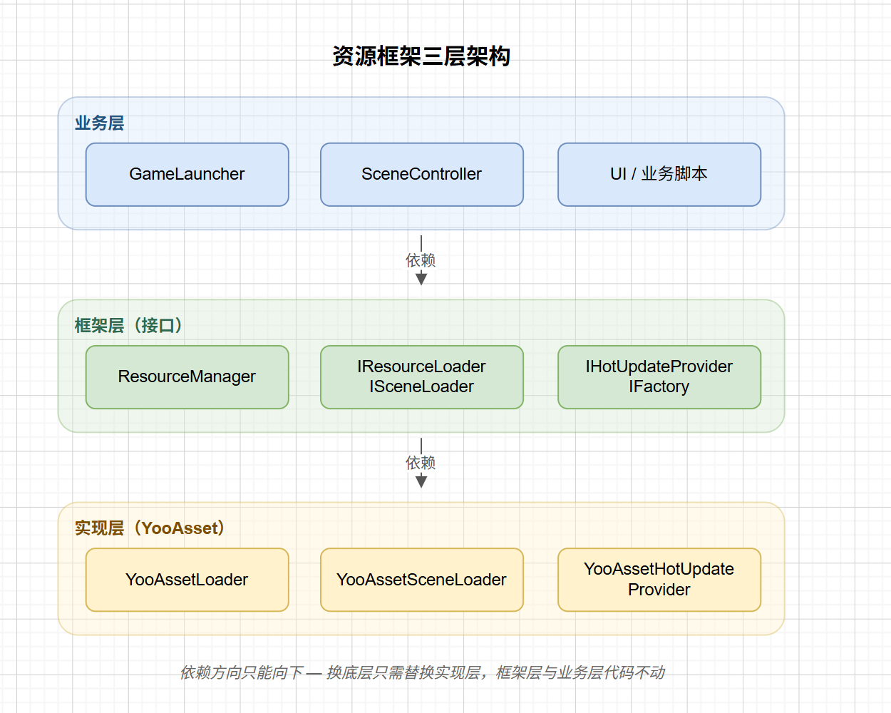
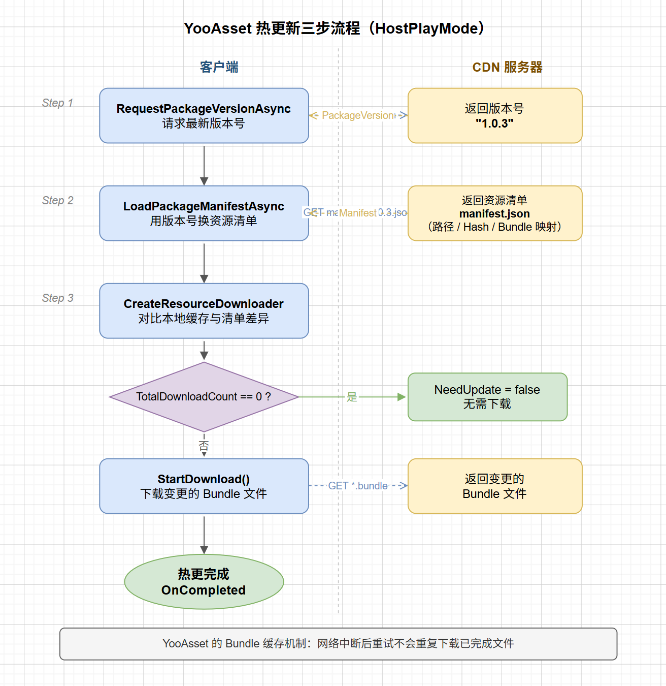

# Unity 资源管理(二)：基于YooAsset的资源管理框架

上一篇讲了 AssetBundle 的四个核心问题：卸载时机、重复打包、依赖加载顺序、版本管理混乱。针对这些问题，Github上的热门框架YooAsset通过强大的自动化工具、精准的依赖分析和完整的热更新工作流，将开发者从繁琐易错的底层细节中解放出来。

本文在介绍 YooAsset 基础用法的同时，重点讲清楚如何在这之上封装一套**可替换底层、可管理多分组热更**的资源框架。

---

## YooAsset 是什么

`YooAsset` 本质上是 `AssetBundle` 的管理层，它不改变 AB 的底层机制，而是在上面提供了一套完整的工作流：资源分组打包、版本管理、热更新下载、运行时加载，全部通过统一的 API 完成。

使用前需要选择 `PlayMode`，对应三种运行场景：

| PlayMode | 说明 |
|---|---|
| `EditorSimulateMode` | 编辑器模拟模式，无需打包，开发阶段调试使用 |
| `OfflinePlayMode` | 单机模式，资源随包体发布，不支持热更新 |
| `HostPlayMode` | 联机模式，支持从远端服务器热更新资源 |

三种模式共用同一套 API，切换只需改初始化参数，业务代码不需要任何改动。

---

## 总体架构设计

直接使用 YooAsset 的话， 每处加载资源都要持有 `AssetHandle`，导致`Handle`分散在各个模块，并且如果后续想换成`Addressable`，那所有代码都得重写，为此我们需要一套资源管理框架。

好的设计应该把变化隔离在一个地方，这里把框架分为三层：

```
业务层   →  ResourceManager（唯一入口）
框架层   →  接口（IResourceLoader / ISceneLoader / IHotUpdateProvider）
实现层   →  YooAsset 具体实现
```



依赖方向只能向下，**框架层不知道实现层的细节**。这是依赖倒置原则（Dependency Inversion）的直接应用：高层模块（业务逻辑）依赖抽象接口，而不是具体的 YooAsset API。将来要换成 Addressables 或自研方案，只需换掉实现层，框架层和业务层的代码不动。通过工厂模式来生成实现层。

---

## 接口设计

四个接口构成了整个框架的骨架。 

**IResourceLoader** —— 资源加载与释放：

```csharp
public interface IResourceLoader
{
    //CancellationToken 用于支持中断下载、场景切换取消加载等异步控制。
    UniTask InitializeAsync(CancellationToken ct = default);
    UniTask<T> LoadAssetAsync<T>(string address, IProgress<float> progress = null,
        CancellationToken ct = default) where T : UnityEngine.Object;
    void ReleaseAsset(string address);
    void ReleaseAll();
    int TrackedAssetCount { get; }
}
```

**ISceneLoader** —— 场景加载，返回 `ISceneHandle` 而不是 YooAsset 的 `SceneHandle`，避免业务代码直接依赖框架类型：

```csharp
public interface ISceneLoader
{
    UniTask<ISceneHandle> LoadSceneAsync(string address, LoadSceneMode mode = LoadSceneMode.Single,
        IProgress<float> progress = null, CancellationToken ct = default);
    UniTask UnloadSceneAsync(ISceneHandle handle);
}
```

**IHotUpdateProvider** —— 热更新流程抽象，下面单独展开讲。

**IResourceFrameworkFactory** —— 工厂接口，通过替换工厂快速迁移底层资源框架：

```csharp
public interface IResourceFrameworkFactory
{
    UniTask InitializeAsync(YooAssetConfig config);  // 负责创建并初始化所有 Package
    IResourceLoader    CreateResLoader(IResourceConfig config);
    ISceneLoader       CreateSceneLoader(IResourceLoader loader);
    IHotUpdateProvider CreateHotUpdateProvider(string groupName);
}
```

---

## ResourceManager：唯一入口

业务代码只需要认识 `ResourceManager` 这一个类。它内部持有所有接口实现，但自身不包含任何资源逻辑：

```csharp
public class ResourceManager : MonoSingleton<ResourceManager>
{
    private IResourceLoader _resourceLoader;
    private ISceneLoader    _sceneLoader;

    // 注入工厂
    public void Setup(IResourceFrameworkFactory factory, object config = null)
    {
        _resourceLoader = factory.CreateResLoader(config);
        _sceneLoader    = factory.CreateSceneLoader(_resourceLoader);
    }

    public async UniTask<T> LoadAssetAsync<T>(string address, ...) where T : Object
        => await _resourceLoader.LoadAssetAsync<T>(address, progress, ct);

    public void ReleaseAsset(string address) => _resourceLoader.ReleaseAsset(address);

    // 场景加载、ReleaseAll、EnsureInitialized 校验... 其余代码省略
}
```

`MonoSingleton<T>` 保证全局唯一。`OnDestroy` 时调用 `ReleaseAll()`，避免场景切换后资源泄漏。

---

## 引用计数：解决重复加载问题

YooAsset 内部已经有资源引用计数机制：同一个资源被多次 `LoadAssetAsync` 时，底层资源不会重复加载，只有所有 `AssetHandle` 都调用 `Release()` 后，资源才会真正进入可回收状态。

但在业务层，如果多个模块各自持有 Handle，容易出现：Handle管理分散，资源释放时机难以统一等问题，

因此，在 `IResourceLoader`（`YooAssetLoader`）层再维护一层业务引用计数，用于统一管理资源：

```csharp
// address → (handle, 引用次数)
private readonly Dictionary<string, (AssetHandle Handle, int Count)> _refs = new();

private void Retain(string address, AssetHandle handle)
{
    if (_refs.TryGetValue(address, out var e))
        _refs[address] = (e.Handle, e.Count + 1);  // 已有，计数+1
    else
        _refs[address] = (handle, 1);               // 首次加载
}

private void Release(string address)
{
    if (!_refs.TryGetValue(address, out var e)) return;
    if (e.Count <= 1) { e.Handle?.Release(); _refs.Remove(address); } // 归零才真正释放
    else _refs[address] = (e.Handle, e.Count - 1);
}
```

每次 `LoadAssetAsync` 调用 `Retain`，每次 `ReleaseAsset` 调用 `Release`。业务代码只需要按需加载、按需释放，不需要关心哪里"也加载过这个资源"。

---

## 热更新流程

YooAsset热更新功能强大，使用起来也非常方便

### 具体流程

YooAsset 的 `HostPlayMode` 热更新分三步：

1. **RequestPackageVersionAsync** —— 从 CDN 拉取最新版本号
2. **LoadPackageManifestAsync** —— 用版本号向 CDN 拉取对应的资源清单（记录了每个资源的路径、Hash、所在 Bundle 等信息）
3. **CreateResourceDownloader + 下载** —— 对比本地缓存与清单的差异，下载变更的 Bundle 文件

`Manifest`清单是整个热更新的核心，不仅记录资源位置，还包含Hash/CRC等校验信息，用于确保下载内容一致性与缓存有效性。



### IHotUpdateProvider 接口

每个 Package（资源分组）对应一个 `IHotUpdateProvider`，封装上面三步：

```csharp
public interface IHotUpdateProvider
{
    event Action<float, long, long> OnProgress;  // 进度、已下载字节、总字节
    event Action<string, string>    OnFileError; // 文件名、错误信息
    event Action<string>            OnError;     // 整体错误
    event Action                    OnCompleted;

    HotUpdateState State              { get; }
    bool           NeedUpdate         { get; }
    int            TotalDownloadCount { get; }
    long           TotalDownloadBytes { get; }

    UniTask RunAsync(CancellationToken ct = default);      // 执行完整热更流程
    UniTask RollbackAsync(string targetVersion, ...);      // 版本回滚
    UniTask ClearUnusedCacheAsync();                       // 清理过期缓存
}

public enum HotUpdateState
{
    Idle, Initializing, GettingVersion, UpdatingManifest,
    CreatingDownloader, Downloading, Done, Error
}
```

`HotUpdateState`用来显示当前状态，UI 层可以订阅 `OnProgress` 事件并根据 `State` 枚举展示对应的下载进度界面。

实现层`YooAssetHotUpdateProvider` 将上面的步骤拆分为三个方法，一步步执行

```csharp
public async UniTask RunAsync(CancellationToken ct = default)
{
    // 任何步骤失败都会 throw，由 HotUpdateRunner 决定是重试还是中止
    await StepGetVersion(ct);     // 拉版本号
    await StepUpdateManifest(ct); // 拉清单
    await StepDownload(ct);       // 差量下载

    SetState(HotUpdateState.Done);
    OnCompleted?.Invoke();
}

private async UniTask StepDownload(CancellationToken ct)
{
    var downloader = _package.CreateResourceDownloader(
        new ResourceDownloaderOptions(_maxConcurrent, _retryCount));

    // TotalDownloadCount == 0 说明本地缓存已是最新，无需下载
    if (downloader.TotalDownloadCount == 0) { NeedUpdate = false; return; }

    downloader.DownloadProgressChanged += args => OnProgress?.Invoke(...);
    downloader.DownloadError           += args => OnFileError?.Invoke(...);

    downloader.StartDownload();
    await downloader.ToUniTask(cancellationToken: ct);
}
```

### HotUpdateRunner：多分组管理

然而在实际项目中，资源往往会拆成多个 Package，比如 `core`（必须热更）、`ui`（按需更新）、`dlc`（可选内容），这时需要通过`HotUpdateRunner` 串行执行所有分组下载逻辑并且展示总的进度：

```csharp
public class HotUpdateRunner
{
    public event Action<string, float, long, long> OnGroupProgress;
    public event Action<float>                     OnTotalProgress; // 全局进度 0~1
    public event Action                            OnAllCompleted;

    private readonly List<(string Name, IHotUpdateProvider Provider)> _providers = new();

    public void AddProvider(string groupName, IHotUpdateProvider provider)
        => _providers.Add((groupName, provider));

    public async UniTask RunAllAsync(CancellationToken ct = default)
    {
        for (int i = 0; i < _providers.Count; i++)
        {
            var (name, provider) = _providers[i];
            provider.OnProgress += (p, done, total) =>
            {
                OnGroupProgress?.Invoke(name, p, done, total);
                // 全局进度 = 已完成分组数 + 当前分组进度，归一化到 [0,1]
                OnTotalProgress?.Invoke((i + p) / _providers.Count);
            };
            await provider.RunAsync(ct);
        }
        OnAllCompleted?.Invoke();
    }
}
```

UI 层只需订阅 `OnTotalProgress` 就能得到一条全局进度条，`OnGroupProgress` 则可以用来显示"正在更新 UI 资源包（23%）"这类分组级别的提示。

---

## 启动流程

把上面所有模块串起来，游戏启动时的完整流程如下：

```csharp
public class GameLauncher : MonoBehaviour
{
    private async UniTaskVoid Start()
    {
        // 1. 构建 YooAsset 配置（整个项目唯一出现 YooAsset 具体类型的地方）
        var config  = new YooAssetConfig { /* PackageName, CDN地址 等 */ };
        var factory = new YooAssetFrameworkFactory();

        // 2. 初始化所有 Package（内部完成 YooAssets.Initialize 和各包的 InitializeAsync）
        await factory.InitializeAllPackagesAsync(config);

        // 3. 注入到 ResourceManager（从此以下，没有任何 YooAsset 代码）
        ResourceManager.Instance.Setup(factory, config);
        await ResourceManager.Instance.InitializeAsync();

        // 4. 热更新：按分组串行执行，UI 层订阅 OnTotalProgress 显示进度条
        var runner = new HotUpdateRunner();
        runner.AddProvider("core", factory.CreateHotUpdateProvider("core"));
        runner.AddProvider("ui",   factory.CreateHotUpdateProvider("ui"));
        runner.OnTotalProgress += p => loadingBar.fillAmount = p;
        await runner.RunAllAsync();

        // 5. 进入游戏
        await ResourceManager.Instance.LoadSceneAsync(AddressHelper.Scene("MainCity"));
    }
}
```

进入游戏后，`GameLauncher` 和所有业务代码都只能看到 `ResourceManager` 的接口，YooAsset 被完整地封装在工厂和实现层里。

---

## 总结

整套设计的核心其实不是 YooAsset，是“资源系统面向抽象编程”，YooAsset 只是当前的一种实现。

框架的核心还是**依赖倒置**设计资源管理系统：ResourceManager 依赖接口，不依赖 YooAsset 具体类型。换框架只需换工厂和实现层，业务代码不动。并且对热更新等流程也进行了封装，使用起来较为方便。

这是资源管理框架的第二篇文章，展示的代码并不完整，需要的话后续可以放到GitHub。

上一篇：[AssetBundle深入解析](https://zhuanlan.zhihu.com/p/2041113873089093801)

下一篇准备讲解UI框架的实现
